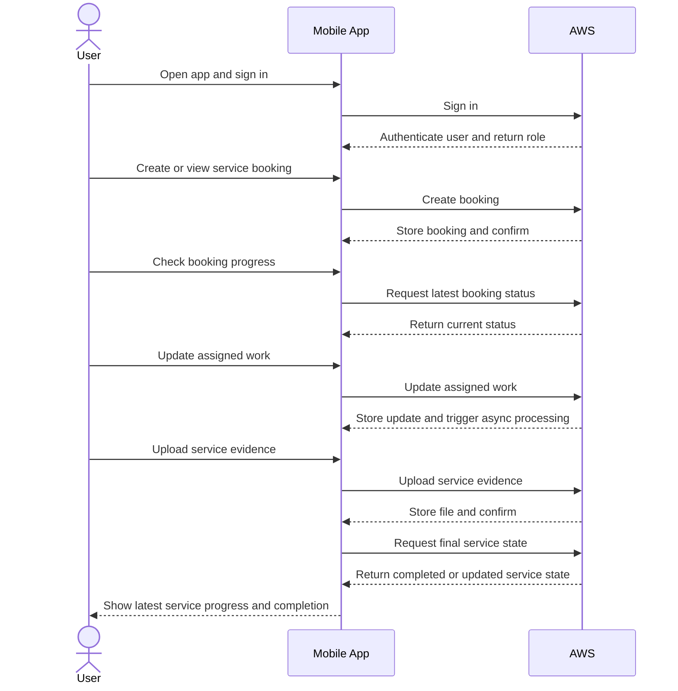

# Service Booking User Flow

This diagram shows the core product flow between the user, the Flutter mobile
app, and AWS.

The same `User` actor represents customer-side interaction first and
technician-side interaction later in the flow, depending on role.

